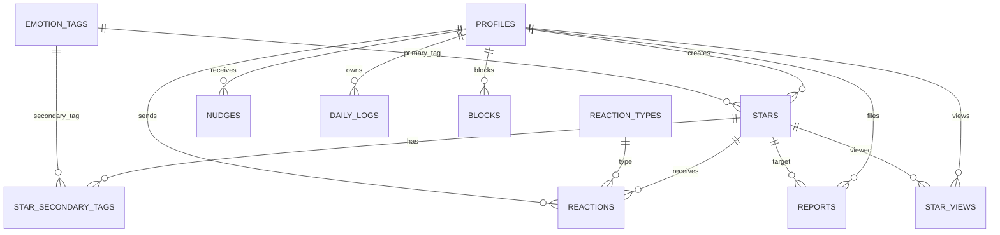

# Mindrouter ERD

## Core Tables

- `profiles`: public profile and device metadata
- `emotion_tags`: fixed emotion taxonomy for MVP
- `stars`: daily emotional posts
- `star_secondary_tags`: optional supporting emotions
- `reaction_types`: predefined reactions only
- `reactions`: one safe reaction per sender per star
- `nudges`: rules-based cards and reaction receipt items
- `daily_logs`: streak and activity tracking
- `blocks`: user-level safety exclusion
- `reports`: content safety reports
- `star_views`: supports excluding already-seen stars from the feed

